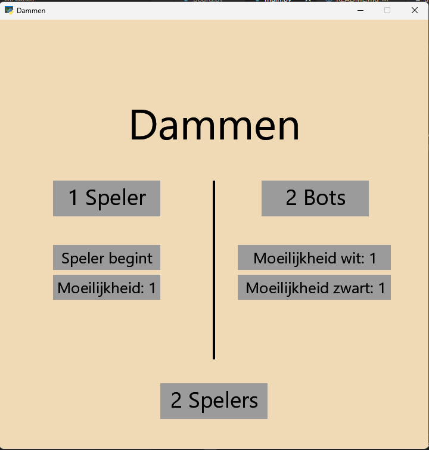

# Dammen met Minimax - IPASS

## Introductie
Dit is mijn IPASS-AI project waarin het minimax algoritme wordt geïmplementeerd op het spel dammen. Zo heb je altijd iemand om tegen te spelen.

## Opdrachtomschrijving
Mijn vader, een beginnende dammer, wilt beter worden met het spel.
Het probleem is alleen dat er niet altijd iemand is die met hem wilt dammen
en zelfs als er iemand is dat het moeilijk is om op zo'n niveau te spelen dat het 
moeilijk is om te winnen maar niet onmogelijk.

Een minimax algoritme denkt een gegeven stappen vooruit en bepaald zo een zet
om te doen, hoe meer stappen er vooruit wordt gedacht, hoe moeilijker.
Zo heeft mijn vader altijd een tegenstander die niet alleen op verschillende niveau's
kan spelen maar ook nog eens consistent die niveaus kan nabootsen.

## Dammen
In dit project wordt er aan de regels van een versie van [Brazilian Checkers](https://en.wikipedia.org/wiki/Brazilian_draughts) gehouden. Het bord is 8x8, en stap maken kan alleen diagonaal 1 vakje vooruit. Als er direct diagonaal voor je een damstuk van de tegenstander is en het vak daarna leg is kan je naar het lege van springen om te slaan, als je kan slaan moet je slaan, als je met hetzelfde stuk meteen door kan slaan kan/moet dat ook, slaan kan ook achteruit. Als je met een damstuk aan de overkant komt krijg je een koning, een koning is niet gelimiteerd met richting en afstand. Als je geen mogelijke zet meer hebt verlies je.

## Applicatie
In deze applicatie zijn er 3 verschillende spel-modussen, PvP, PvE en EvE.
* PvP: Er wordt een functionerend dambord weergeven, twee mensen kunnen tegen elkaar spelen op de computer
* PvE: Een mens speelt tegen de computer (de bot), de mens kan kiezen wie er begint en hoe goed de computer speelt (1-7)
* Eve: Twee bots spelen tegen elkaar, de mens kan kiezen hoe goed de verschillende bots spelen om vervolgens elke zet te kunnen volgen en spel-situaties na gaan om te kijken wat goede zetten zijn volgens de computer óf om te kijken naar de consistentie van de werking van het algoritme.

## Algoritme
Zoals eerder gemeld wordt het [minimax algoritme](http://users.encs.concordia.ca/~kharma/coen352/Project/Minimax-notes.pdf) met [alpha-beta pruning](https://www.geeksforgeeks.org/minimax-algorithm-in-game-theory-set-4-alpha-beta-pruning/) gebruikt. Het minimax algoritme kijkt naar alle mogelijke zetten van beide spelers in de komende x beurten. Vervolgens bepaalt het welke zet er gedaan moet worden, in gedachten dat de tegenstander perfect speelt. Alpha-beta pruning kan detecteren wanneer een stap sowieso niet handig is om te zetten en stopt een ondertak van minimax dan vroegtijdig om efficientie te verhogen.

## Opzet
### Benodigdheden
* pyglet
* numpy
* random
* copy

Om het programma af te spelen hoeft u alleen [checkers.exe](checkers.exe) te openen

## FAQ
* Q: Hoe kan ik een moeilijkheid selecteren in het menu?